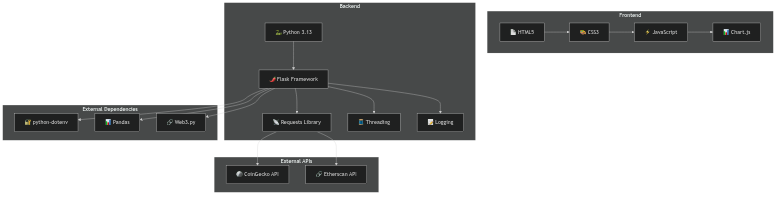

# Crypto Portfolio Tracker

A Flask-based web application for tracking cryptocurrency prices and wallet balances with **real-time transaction streaming**.

## Features

- **Real-time Crypto Charts**: Interactive price charts for multiple cryptocurrencies
- **Live Wallet Tracking**: Monitor Ethereum wallet balances and values with real-time updates
- **Real-time Transaction Streaming**: Get instant notifications when new transactions occur
- **Historical Data**: View price history over different time periods (30 days, 1 year, all time)
- **API Integration**: RESTful API endpoints for data access
- **Server-Sent Events**: Real-time updates using SSE for live transaction monitoring

## Real-time Features

### 🚀 Live Transaction Streaming
- **Automatic Updates**: New transactions appear instantly without page refresh
- **Visual Notifications**: New transactions are highlighted with animations
- **Browser Notifications**: Desktop notifications for new transactions (with permission)
- **Connection Status**: Real-time status indicator showing streaming connection
- **Auto-reconnection**: Automatically reconnects if connection is lost

### 📊 Real-time Monitoring
- **Transaction Count**: Live counter showing total transactions
- **Time Stamps**: Real-time transaction timestamps
- **Gas Information**: Transaction gas details
- **Value Tracking**: Real-time ETH value calculations

## Supported Cryptocurrencies

- Ethereum (ETH)
- Bitcoin (BTC)
- Solana (SOL)
- Tether (USDT)
- USD Coin (USDC)
- Dai (DAI)

## System Design

### Architecture Overview


### API Endpoints & Data Flow


### Technology Stack


### Data Flow Architecture


### Component Relationships


### File Structure


### Real-time Data Flow


## Installation

1. Clone the repository:
```bash
git clone <repository-url>
cd Crypto-portfolio-tracker
```

2. Install dependencies:
```bash
pip install -r requirements.txt
```

3. Set up your Etherscan API key (optional, for wallet tracking):
   - Get a free API key from [Etherscan](https://etherscan.io/apis)
   - Update the `ETHERSCAN_API_KEY` in `crypt.py`

## Running the Application

1. Start the Flask server:
```bash
python app.py
```

2. Open your browser and navigate to:
```
http://localhost:5000
```

## API Endpoints

### Chart Data
- `GET /api/chart/<coin_id>?days=<days>` - Get historical price data
- Example: `/api/chart/ethereum?days=30`

### Current Prices
- `GET /api/price/<coin_id>` - Get current price for a coin
- Example: `/api/price/ethereum`

### Wallet Data
- `GET /api/wallet/<address>` - Get wallet balance and value
- Example: `/api/wallet/0x742d35Cc6634C0532925a3b8D4C9db96C4b4d8b6`

### Real-time Streaming
- `GET /api/stream/transactions/<address>` - Server-Sent Events stream for real-time transactions
- Example: `/api/stream/transactions/0x742d35Cc6634C0532925a3b8D4C9db96C4b4d8b6`

### Available Coins
- `GET /api/coins` - Get list of supported cryptocurrencies

## Real-time Usage

### Wallet Tracking
1. Navigate to `/wallet`
2. Enter an Ethereum wallet address
3. Click "Track" to start monitoring
4. Watch for real-time updates:
   - 🟢 Green indicator shows active streaming
   - New transactions appear at the top with animations
   - Browser notifications (if permitted)
   - Live transaction counter

### Features
- **Auto-refresh**: Transactions update automatically
- **Visual feedback**: New transactions are highlighted
- **Connection monitoring**: Status indicator shows streaming health
- **Error handling**: Automatic reconnection on connection loss

## File Structure

- `app.py` - Main Flask application with SSE streaming
- `crypt.py` - Ethereum wallet and price tracking functions
- `price_history.py` - Historical price data functions
- `templates/main.html` - Price charts interface
- `templates/wallet.html` - Real-time wallet tracker
- `static/` - Static assets (icons, etc.)
- `requirements.txt` - Python dependencies

## Technical Details

### Server-Sent Events (SSE)
- Uses Flask's Response with `mimetype='text/event-stream'`
- Background threads monitor transactions every 5 seconds
- Automatic connection management and cleanup
- Heartbeat messages every 30 seconds

### Real-time Features
- **EventSource API**: Browser-native SSE implementation
- **Threading**: Background transaction monitoring
- **Connection pooling**: Multiple clients can monitor same address
- **Error recovery**: Automatic reconnection on failures

## Dependencies

- Flask - Web framework with SSE support
- requests - HTTP library for API calls
- pandas - Data manipulation
- threading - Background task management
- Chart.js - Frontend charting library

## Browser Compatibility

- **Chrome/Edge**: Full support for SSE and notifications
- **Firefox**: Full support for SSE and notifications
- **Safari**: SSE support, limited notification support
- **Mobile**: SSE works, notifications may be limited

## License

This project is open source and available under the MIT License.